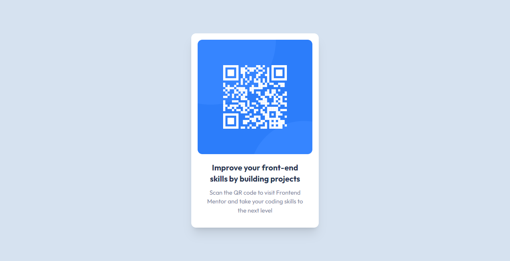

# qr-code-component

Frontend Mentor Challenge

<h2 align="center">Links</h2>

- Solution URL: [QR code component | Frontend Mentor](https://www.frontendmentor.io/solutions/css-grid-9FwhLtRMFF)
- Live Site URL: [https://article-preview-component-hdez.vercel.app/](https://jenacarry.github.io/qr-code-component/)